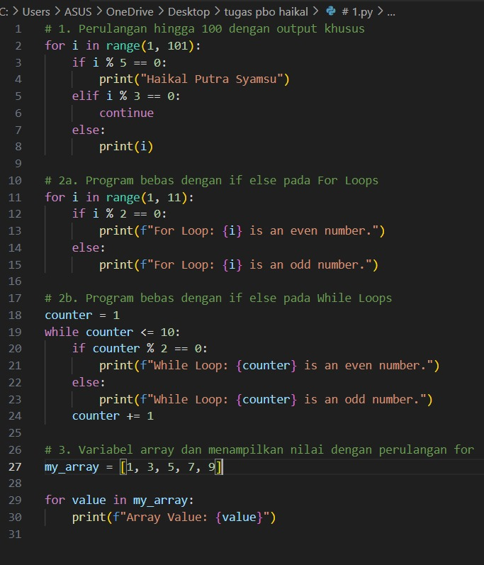

# nama:Haikal putra syamsu

# NPM : G1F022071

## kode 

## output

## Penjelasan

1. - Ini adalah perulangan dari 1 hingga 100 menggunakan loop for.
- Jika i habis dibagi 5, maka cetak "Haikal Putra Syamsu".
- Jika i habis dibagi 3, maka skip iterasi ini dengan menggunakan continue.
- Jika tidak, cetak nilai i.

2. - Ini adalah perulangan menggunakan loop while dari 1 hingga 10.
- Jika counter habis dibagi 2, maka cetak bahwa counter adalah bilangan genap.
- Jika tidak, cetak bahwa counter adalah bilangan ganjil.
- Tingkatkan nilai counter setiap iterasi.

3. - Ini adalah perulangan menggunakan loop while dari 1 hingga 10.
- Jika counter habis dibagi 2, maka cetak bahwa counter adalah bilangan genap.
- Jika tidak, cetak bahwa counter adalah bilangan ganjil.
- Tingkatkan nilai counter setiap iterasi.

4. - Ini adalah deklarasi variabel my_array yang berisi beberapa nilai.
- Gunakan loop for untuk mencetak setiap nilai dalam array bersama dengan pesan tambahan.